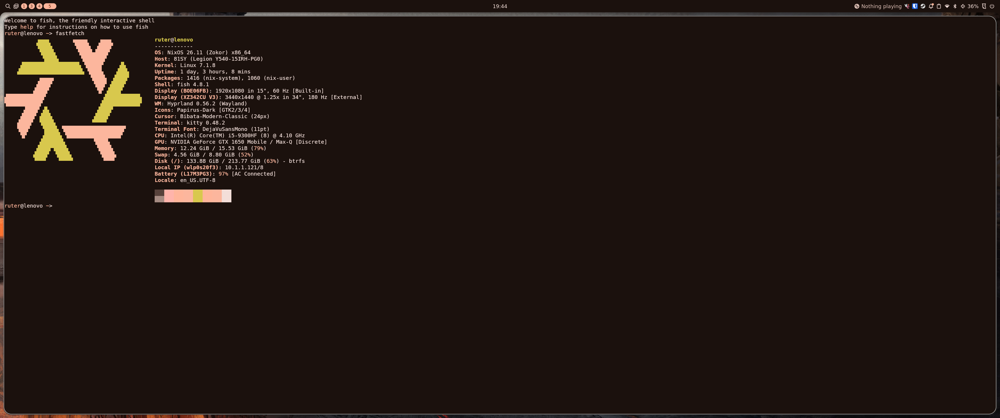

# nix-config

My personal NixOS configuration, managed with **Nix Flakes** and **Home Manager**.

## Hosts

Currently supported hosts:

* **lenovo** - Lenovo laptop configuration with Hyprland, Noctalia and Nvidia drivers.
* **surface** - Microsoft Surface configuration with GNOME and Surface-specific hardware support.


## Usage

Clone the repository:

```
git clone https://github.com/rutra8002/nix-config
cd nix-config
```

Build a configuration for lenovo:

```
sudo nixos-rebuild switch --flake .#lenovo
```

Build a configuration for surface:

```
sudo nixos-rebuild switch --flake .#surface
```

Update flake inputs:

```
nix flake update
```

## Showcase

